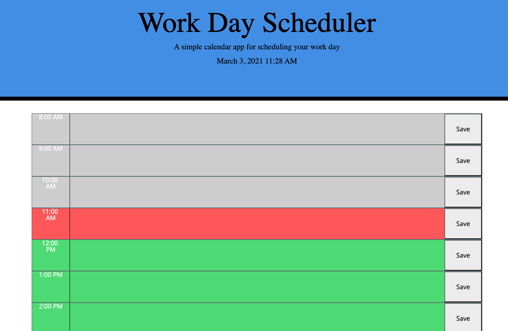

# Workday-Scheduler

https://github.com/Laurenzel93/workday-scheduler  
https://laurenzel93.github.io/workday-scheduler/  

This app is a simple hourly day planner for users to be able to plan their workday.  
I used the [Moment.js](https://momentjs.com/) library to work with date and time.  
Techologies: HTML, CSS, JavaScript 

